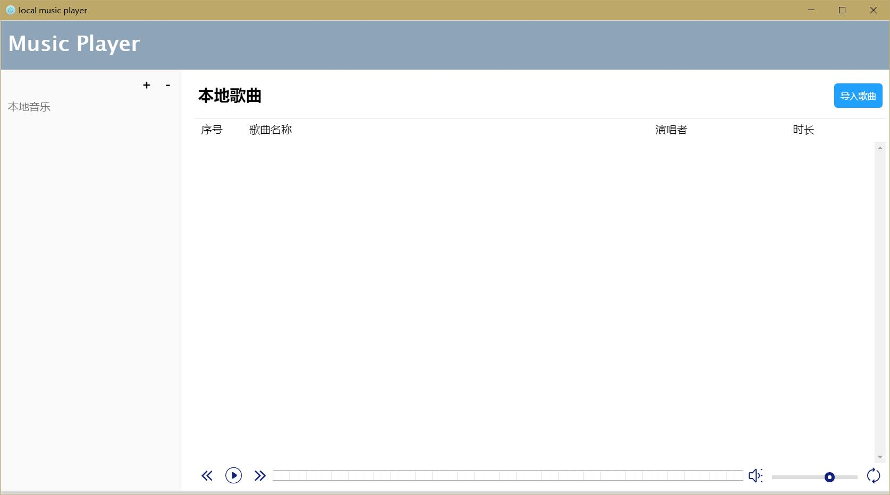

# Local Music Player
 

**基于Vue和Electron的本地桌面音乐播放器**

**寒假很无聊，想学点新东西，无意间了解了Electron并做了一个小demo，并且后来学习了前端框架Vue，因此想结合最近自己看的内容做一个小东西，顺便巩固学到的知识**

**flex + Electron + Vue + node.js**

**感觉以后跨平台的技术一定会得到重视，而Electron是一个很好的东西**

## V0.1

初级版本，只完成了部分静态页面

## V0.9
完成于2018-03-09 15:14
**完成了基础功能，如**：
>* 导入歌曲
* 删除、添加歌单
* 音乐的播放暂停、上一曲、下一曲
* 播放音量调节
* 播放跳转
* 改变播放模式(列表循环，单曲循环，随机播放)

**待解决的问题：**
>* 无法在本地分析音频的长度、歌曲名、演唱者等信息
* 对每一歌曲的右键菜单的删除选项还没有做好
* 以及更多的想要开发的功能...

-------------------------------------------------
#### 全局待解决的问题：不是很懂如何自己写响应式的布局，这样的话才能真正做到一套代码多处使用，因为我是很钦佩Electron这个框架的，感觉真的很厉害。
-------------------------------------------------
#### **因为没有打包，使用前需要有node和electron环境，启动双击"启动.bat"即可**

-------------------------------------------------
**最后的话：
大三了，还是准备考研吧，虽然我真的很想试一下去大公司实习，因为看着同学们纷纷试着投各个公司的实习，很是羡慕。但是还是耐下性子打算考研吧，这个程序是打算考研之前着手的，因为每天就写那么1、2个小时，再加上不熟悉node.js和Vue进度有点慢了，如果不写完这个程序就老是心理不舒服，所以这回基础功能基本已经完成了，就停一下吧，先准备考研了~**
